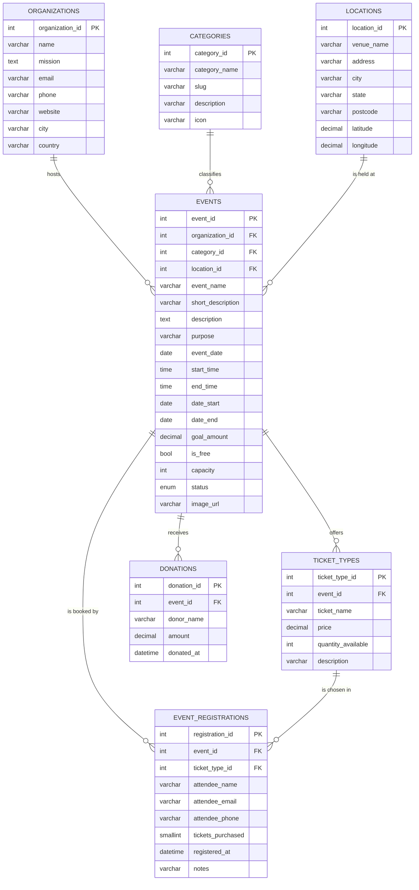

# Database design - Charity Events (`charityevents_db`)

PROG2002 Web Development II - Assessment 3, Part 1

---

## 1. Why this design

The case study needs a website that can:

* list currently available and **upcoming** charity events on the home page,
* mark events as **past** based on their dates and today's date,
* **hide suspended** events that breach policy,
* let visitors **search** by date, location and category,
* show **full detail** for one event including **ticket information** and
  **goal vs. progress** for a fundraising target,
* identify which **charitable organisation** runs each event and which
  **category** it belongs to,
* **register** a visitor for an event: their details, the date of registration,
  the ticket tier, how many tickets, and the value of the purchase (**A3**),
* let staff list **every** event whatever its status, and prevent the deletion of
  an event that has already received registrations (**A3**).

Each of those needs maps onto a table or a view, which is what drove the schema
below. Three lookup tables hold values that repeat (`organizations`,
`categories`, `locations`), one table holds the main resource (`events`), and
three child tables hold repeating detail about an event (`ticket_types`,
`donations`, `event_registrations`).

A3 did not redesign any of this. It **added** one table and one relationship,
began using `locations.latitude` / `longitude` (present since A2, unused until
the weather feature needed them), and moved the shared column list into a view so
that the public and admin listings cannot drift apart.

---

## 2. Entity relationship diagram



The `TICKET_TYPES ||--o{ EVENT_REGISTRATIONS` relationship is drawn with the tier
on the "one" side because a tier can appear in many registrations. It is
**optional** on the registration side (the column is nullable), and it is
implemented with a single-column foreign key on `ticket_type_id` plus an API rule;
ticket id alone - see 3.7 and section 5.

### Text version of the same diagram

```
   +----------------+          +----------------+          +----------------+
   | organizations  |          |  categories    |          |   locations    |
   +----------------+          +----------------+          +----------------+
   | organization_id|          | category_id    |          | location_id    |
   | name           |          | category_name  |          | venue_name     |
   | mission        |          | slug           |          | address / city |
   | email / phone  |          | description    |          | state/postcode |
   +--------+-------+          +--------+-------+          | lat / lon      |
            | 1                         | 1                +--------+-------+
            |                           |                           | 1
            | hosts                     | classifies                | is held at
            |                           |                           |
            | N                         | N                         | N
   +--------+---------------------------+---------------------------+--------+
   |                                  events                                |
   | event_id (PK) | organization_id (FK) | category_id (FK) | location_id (FK)|
   | event_name | short_description | description | purpose                 |
   | event_date | start_time | end_time | date_start | date_end                |
   | goal_amount | is_free | capacity | status | image_url                    |
   +---+---------------------+----------------------+-----------------+----+
       | 1                   | 1                    | 1               |
       |                     |                      |                 |
       | offers              | receives             | is booked by    |
       |                     |                      |                 |
       | N                   | N                    | N               |
   +---+-----------------+  +---+--------------+  +--+------------------------+
   |   ticket_types      |  |   donations    |  |   event_registrations     |
   | ticket_type_id (PK) |  | donation_id PK |  | registration_id (PK)      |
   | event_id (FK)       |  | event_id (FK)  |  | event_id (FK) RESTRICT    |
   | ticket_name | price |  | donor_name     |  | ticket_type_id (FK, NULL) |
   | quantity_available  |  | amount         |  | attendee_name / _email    |
   | UNIQUE(event_id,    |  | donated_at     |  | attendee_phone (NULL)     |
   |        ticket_name) |  +----------------+  | tickets_purchased         |
   +---------------------+                      | registered_at | notes     |
            ^                                   | UNIQUE(event_id, email)   |
            |                                   +---------------------------+
            +--- FK ticket_type_id (the API also checks it belongs to this event)
                 so a tier can only come from the same event
```

---

## 3. Table dictionary

### 3.1 `organizations`
The charitable organisations that host events.

| Column | Type | Key | Notes |
| --- | --- | --- | --- |
| `organization_id` | INT UNSIGNED | PK, auto | Surrogate key |
| `name` | VARCHAR(150) | UNIQUE | Organisation name |
| `mission` | TEXT | | Mission statement shown on the site |
| `email` | VARCHAR(150) | | CHECK enforces an `@` and a dot |
| `phone` | VARCHAR(30) | | Optional |
| `website` | VARCHAR(200) | | Optional |
| `city` | VARCHAR(100) | | Head office city |
| `country` | VARCHAR(100) | | Defaults to Australia |
| `created_at` | TIMESTAMP | | Audit column |

### 3.2 `categories`
Event types: fun run, gala dinner, silent auction, concert, food drive, golf
day, art exhibition, virtual challenge.

| Column | Type | Key | Notes |
| --- | --- | --- | --- |
| `category_id` | INT UNSIGNED | PK, auto | |
| `category_name` | VARCHAR(80) | UNIQUE | Displayed as a chip on each card |
| `slug` | VARCHAR(80) | UNIQUE | URL-friendly name |
| `description` | VARCHAR(255) | | One line explanation |
| `icon` | VARCHAR(40) | | Icon key used by the front end |

### 3.3 `locations`
Normalised venue information, so the same venue is never typed twice.

| Column | Type | Key | Notes |
| --- | --- | --- | --- |
| `location_id` | INT UNSIGNED | PK, auto | |
| `venue_name` | VARCHAR(150) | UNIQUE with city | |
| `address` | VARCHAR(200) | | Street address |
| `city` | VARCHAR(100) | INDEX | The search filter uses this |
| `state` | VARCHAR(50) | | NSW / QLD / NT / AUS |
| `postcode` | VARCHAR(10) | | |
| `latitude` / `longitude` | DECIMAL(9,6) | | **Used from A3**: sent to Open-Meteo for the event-day forecast. NULL for the online venue, which correctly suppresses the forecast instead of guessing a location |

### 3.4 `events` (the main resource)

| Column | Type | Key | Notes |
| --- | --- | --- | --- |
| `event_id` | INT UNSIGNED | PK, auto | Passed in the URL as `event.html?id=` |
| `organization_id` | INT UNSIGNED | FK | RESTRICT on delete |
| `category_id` | INT UNSIGNED | FK | RESTRICT on delete |
| `location_id` | INT UNSIGNED | FK | RESTRICT on delete |
| `event_name` | VARCHAR(180) | | |
| `short_description` | VARCHAR(300) | | Used on the summary cards |
| `description` | TEXT | | Full description on the detail page |
| `purpose` | VARCHAR(300) | | The cause the money supports |
| `event_date` | DATE | | The headline date shown to visitors |
| `start_time` / `end_time` | TIME | | CHECK `end_time > start_time` |
| `date_start` / `date_end` | DATE | INDEX | The window used to derive past / upcoming |
| `goal_amount` | DECIMAL(12,2) | | Fundraising target, CHECK `>= 0` |
| `is_free` | TINYINT(1) | | Free events shown as "Free entry" |
| `capacity` | INT UNSIGNED | | NULL = no limit |
| `status` | ENUM | INDEX | `active`, `suspended`, `cancelled` |
| `image_url` | VARCHAR(400) | | Category artwork file name |
| `created_at` / `updated_at` | TIMESTAMP | | Audit columns |

**Why two date pairs?** `event_date` is the simple date a visitor reads, while
`date_start`/`date_end` describe the full window. A one-day fun run has the
same value in all three; the three-week art exhibition has
`date_start = 2026-12-04` and `date_end = 2026-12-20`, so the website can say
"On now" while it is running instead of pretending it has not started.

### 3.5 `ticket_types`
Price tiers per event. A price of `0.00` is a legitimate free tier, which is
how the brief's "the price, or even a free one" is satisfied.

| Column | Type | Key | Notes |
| --- | --- | --- | --- |
| `ticket_type_id` | INT UNSIGNED | PK, auto | |
| `event_id` | INT UNSIGNED | FK | CASCADE on delete |
| `ticket_name` | VARCHAR(100) | UNIQUE with event | e.g. "10 km Timed Run" |
| `price` | DECIMAL(10,2) | | CHECK `>= 0`, `0.00` = free |
| `quantity_available` | INT UNSIGNED | | NULL = unlimited |
| `description` | VARCHAR(255) | | What the tier includes |

The uniqueness is `UNIQUE (event_id, ticket_name)`. A3 does **not** use that pair
as the target of a foreign key: MySQL refuses a foreign key that references a
unique key sharing its leading column with another unique index on the table
(`ERROR 6125`), and this table already has `PRIMARY KEY (ticket_type_id)` and
`UNIQUE (event_id, ticket_name)`. `event_registrations.ticket_type_id` therefore
references the primary key instead, and the "same event" rule lives in the API.
The full reasoning is in §3.7 under *Why the ticket tier is a plain foreign key*.

### 3.6 `donations`
Recorded gifts towards an event, which produce the "Goal vs. Progress" figures.
A2 only read these rows. A3 does not create them either - the brief asks for
registration, not donation entry - so from the API's point of view this table
stays read-only.

| Column | Type | Key | Notes |
| --- | --- | --- | --- |
| `donation_id` | INT UNSIGNED | PK, auto | |
| `event_id` | INT UNSIGNED | FK | CASCADE on delete |
| `donor_name` | VARCHAR(120) | | Defaults to "Anonymous" |
| `amount` | DECIMAL(10,2) | | CHECK `> 0` |
| `donated_at` | DATETIME | | Defaults to now |

### 3.7 `event_registrations` (A3 - the eighth table)
Who registered for which event, and what they bought. This is the table the A3
brief asks for, and it is the only table that was added.

| Column | Type | Key | Null? | Default | Why it exists |
| --- | --- | --- | --- | --- | --- |
| `registration_id` | INT UNSIGNED | PK, auto | no | auto | Surrogate key. It is the id in `/api/registrations/:id`, and the tie-breaker in the "newest first" ordering |
| `event_id` | INT UNSIGNED | FK → `events` | no | - | The event being registered for. `ON UPDATE CASCADE ON DELETE RESTRICT` |
| `ticket_type_id` | INT UNSIGNED | FK → `ticket_types (ticket_type_id)` | **yes** | NULL | The tier chosen. Optional so a registration can exist without a tier; the API additionally rejects a tier that belongs to a different event |
| `attendee_name` | VARCHAR(120) | | no | - | Who is attending. The brief does not require a user table, so the attendee's details live on the registration row |
| `attendee_email` | VARCHAR(150) | part of UNIQUE | no | - | The identifier of the person. The API stores it trimmed and lower-cased |
| `attendee_phone` | VARCHAR(30) | | **yes** | NULL | Contact number. Optional, so the form can leave it empty |
| `tickets_purchased` | SMALLINT UNSIGNED | | no | 1 | "The number of tickets purchased". `SMALLINT` is ample for one booking, and the API caps a single booking at 20 |
| `registered_at` | DATETIME | INDEX (with `event_id`) | no | `CURRENT_TIMESTAMP` | "The date of registration". A `DATETIME`, not a `DATE`, because the page sorts by it and two registrations made on the same day must still order correctly |
| `notes` | VARCHAR(300) | | **yes** | NULL | Anything the attendee wants the organiser to know |

**Indexes and constraints on this table**

| Name | Columns | Kind | What it is for |
| --- | --- | --- | --- |
| `PRIMARY` | `registration_id` | PK | Direct lookup, and the ordering tie-breaker |
| `uq_registration_event_email` | `(event_id, attendee_email)` | UNIQUE | **The rule**: one person may register for many events, but only once for any one event |
| `idx_registrations_event` | `(event_id, registered_at)` | index | The event page's list is "this event, newest purchase first", so one composite index answers the whole query |
| `idx_registrations_email` | `(attendee_email)` | index | The admin search by attendee, and "where else is this person registered?" |
| `idx_registrations_ticket` | `(ticket_type_id)` | index | Counting how many of a tier have gone, which the remaining-allocation check needs |
| `fk_registration_event` | `(event_id)` | FK | A registration cannot name an event that does not exist; `ON DELETE RESTRICT` backs the API's delete rule |
| `fk_registration_ticket` | `(ticket_type_id)` | FK | A registration cannot name a tier that does not exist. That the tier belongs to the SAME event is checked by the API (a 400), because MySQL will not accept the composite key - see below |
| `chk_registration_tickets` | `(tickets_purchased >= 1)` | CHECK | A registration for zero tickets is meaningless |
| `chk_registration_email` | `(attendee_email LIKE '%_@_%._%')` | CHECK | Basic email shape, matching the check already on `organizations.email` |

**Why the unique key is on the pair, not on the email.** The brief's wording is
exact: "a user may register for multiple events but can only register for an
event once." A unique key on `attendee_email` alone would forbid the first half
of that sentence - the same person could never register for a second event. The
key is therefore `(event_id, attendee_email)`: the same email twice for event 1
is a duplicate; the same email once for event 1 and once for event 2 is fine.
MySQL's default collation `utf8mb4_0900_ai_ci` compares that pair
case-insensitively, and the API additionally trims and lower-cases the address
before writing, so `"Ann@Example.com "` cannot slip past as a different person.

**Why the ticket tier is a plain foreign key, not a composite one.**
`ticket_type_id` on its own guarantees the tier EXISTS, which is what the
foreign key is for. That the tier belongs to the **same event** is a rule the API
enforces: `registrationService.createRegistration()` looks the tier up inside the
event and rejects a mismatch with a 400 naming `ticketTypeId`, and the offline
repository applies the identical check so both data sources answer the same way.

The natural way to express "the same event" as a database constraint is a
composite foreign key, `(event_id, ticket_type_id) → ticket_types (event_id,
ticket_type_id)`. **MySQL will not accept it here, for two independent reasons,
both discovered by loading this schema rather than by reading the manual:**

1. `ERROR 6125 - Failed to add the foreign key constraint. Missing unique key for
   constraint 'fk_registration_ticket' in the referenced table 'ticket_types'.`
   A foreign key may not reference a unique key that shares its leading column
   with another unique index on that table, and `ticket_types` already has
   `PRIMARY KEY (ticket_type_id)` and `UNIQUE (event_id, ticket_name)`.
2. `ERROR 3109 - Generated column 'event_tier_key' cannot refer to auto-increment
   column.` The standard workaround - a derived key column the foreign key can
   point at - is refused because the value has to be built from
   `ticket_type_id`, which is `AUTO_INCREMENT`.

A trigger could enforce the rule instead, but a trigger is invisible to anyone
reading the schema, and it would move a rule that already works and is already
covered by the automated checks out of the application and into a place the marker
has to go looking for. The API rule is the documented behaviour; the foreign key
is the safety net for "the tier must exist at all".

**Why the price is not copied here.** A tempting shortcut is to store the amount
paid on the registration. It is deliberately left out: the tier name and the
money are read from `ticket_types` (the view in 4.5 multiplies
`tickets_purchased` by `price`). Copying the price would create two versions of
the truth the moment a tier price changed, and what the assessment displays is
the current price of the tier, not an accounting ledger. The trade-off is
recorded here because a reviewer would reasonably ask: a real ticketing system
would snapshot the price at purchase time, and that would be the change to make.

**Do we need a user table?** No. The brief says a user table is not required, so
there is no `users` table and account management is not part of the design; the
attendee's details are attributes of the registration itself. That is also why
"one user, one registration per event" is enforced on the email address rather
than on a user id.

---

## 4. The views

A2 had two views. A3 keeps both - one of them rewritten - and adds three, so the
schema now has five. They exist so that a rule or a calculation lives in exactly
one place instead of being repeated in every query.

### 4.1 `vw_event_progress` (A2, unchanged)
Totals the donations per event and works out the percentage.

```sql
ROUND(SUM(d.amount) / e.goal_amount * 100, 1)
```

`raised_amount` and `progress_percent` are exposed by a view rather than a
`GENERATED` column, because MySQL does not allow a generated column to read
another table. Keeping them here means every endpoint reports the same figure. It
also caps the percentage with `LEAST(..., 100)`, so an over-funded event draws a
full bar rather than one wider than its track.

### 4.2 `vw_event_columns` (A3, new) - the shared column list
Every column of an event, joined to its organisation, category and location and
to `vw_event_progress`, plus the three derived values:

```sql
CASE
  WHEN e.date_end   < CURDATE() THEN 'past'
  WHEN e.date_start <= CURDATE() THEN 'ongoing'
  ELSE 'upcoming'
END                                        AS event_state,
(SELECT COUNT(*) FROM event_registrations r
  WHERE r.event_id = e.event_id)           AS registration_count,
(SELECT COALESCE(SUM(r.tickets_purchased), 0)
   FROM event_registrations r
  WHERE r.event_id = e.event_id)           AS tickets_sold
```

Why this view exists: A2's `vw_public_events` was one large `SELECT`. A3 needed
the same rows twice - once with the status filter for the public site, once
without it for the admin site - and two copies of a thirty-column `SELECT` is
exactly how two listings start disagreeing about a figure. The columns (and the
registration counts) are therefore defined once here, and the next two views are
one line each. `latitude` and `longitude` are part of this list too, which is how
the event detail endpoint serves the weather panel's coordinates without a second
query.

### 4.3 `vw_public_events` (A2 rule, A3 definition)
```sql
CREATE OR REPLACE VIEW vw_public_events AS
SELECT * FROM vw_event_columns WHERE status = 'active';
```

The behaviour is exactly what A2 was marked on, and `WHERE status = 'active'` is
still the reason a suspended event cannot leak onto the home page, the search
page or the detail page - even if a future endpoint forgets to filter. A3 only
changed **where the column list comes from**: the view now selects from
`vw_event_columns` instead of repeating the joins. Past events remain included
here, so the search page can still show history with `state=all`; the home page
excludes them by adding `event_state <> 'past'`.

### 4.4 `vw_all_events` (A3, new) - the admin view
```sql
CREATE OR REPLACE VIEW vw_all_events AS
SELECT * FROM vw_event_columns;
```

The same rows **without** the status filter. The A3 brief requires the admin site
to display "a complete list of all registered events, regardless of their status
(Active, Past, Suspended)", and the public view cannot do that by construction.
Rather than weaken `vw_public_events`, A3 adds a second view that only the admin
routes read: `?audience=admin` on `/api/events`, and everything under
`/api/admin/...`. Those are the only two callers, so the public rule stays intact
while the admin listing sees everything.

### 4.5 `vw_event_registrations` (A3, new) - a readable registration
One registration with everything the client and admin pages need:

| Column | Comes from | Note |
| --- | --- | --- |
| `registration_id`, `event_id`, `ticket_type_id`, `attendee_name`, `attendee_email`, `attendee_phone`, `tickets_purchased`, `registered_at`, `notes` | `event_registrations` | The stored row, unchanged |
| `event_name` | `events` | So a list across all events is readable |
| `ticket_name`, `ticket_price` | `ticket_types` | `LEFT JOIN`, because the tier is optional |
| `total_amount` | computed | `tickets_purchased * COALESCE(ticket_price, 0)` |

`total_amount` is the value of one booking, and it is deliberately computed at
read time rather than stored (3.7). A `LEFT JOIN` is used rather than an inner
join so that a registration with no tier still appears, with `total_amount` 0.
The API's read queries select the same expressions directly, so the view and the
endpoint cannot disagree about the arithmetic.

---

## 5. Data integrity decisions

| Decision | Reason |
| --- | --- |
| `ON DELETE RESTRICT` for the three event FKs | An organisation, category or location in use must not disappear |
| `ON DELETE CASCADE` for `ticket_types` and `donations` | These rows have no meaning without their event |
| **`ON DELETE RESTRICT` for `event_registrations.event_id`** (**A3**) | The database-level half of the rule "an event can only be deleted when it has not yet received any registrations" - see below |
| `ON DELETE RESTRICT` for the ticket FK | A booking must not outlive the tier it was made against |
| **`UNIQUE (event_id, attendee_email)`** (**A3**) | One registration per person per event, while still allowing many events per person |
| `UNIQUE (venue_name, city)` | Stops the same venue being created twice |
| `UNIQUE (event_id, ticket_name)` | Stops duplicate price tiers on one event |
| `CHECK (date_end >= date_start)` | Rejects impossible date windows |
| `CHECK (end_time > start_time)` | Rejects impossible times |
| `CHECK (goal_amount >= 0)`, `CHECK (price >= 0)`, `CHECK (amount > 0)` | Rejects negative money |
| **`CHECK (tickets_purchased >= 1)`** (**A3**) | A booking for zero tickets is a data-entry mistake, not a free ticket |
| `CHECK (email LIKE '%_@_%._%')`, **`CHECK (attendee_email LIKE '%_@_%._%')`** (**A3**) | Basic email shape at the database level |
| `utf8mb4` / `utf8mb4_0900_ai_ci` | Correct storage and comparison for all names, and the same default collation that MySQL 8.0+ uses, so string comparisons in views never raise "illegal mix of collations". On MySQL 5.7 replace this with `utf8mb4_unicode_ci` |
| Indexes on `date_start/date_end`, `status`, and each FK | The filter columns are the ones the API queries |
| **`idx_registrations_event (event_id, registered_at)`** (**A3**) | One index serves both halves of "this event, newest purchase first" |

Validation is deliberately done in **three** layers, which is worth explaining
in the video:

1. the **client** checks the form so the visitor gets instant feedback,
2. the **API service layer** validates every query parameter and every body field
   and returns a 400 with field-level details,
3. the **database** enforces types, keys, uniqueness and CHECK constraints.

### Why `ON DELETE RESTRICT` rather than a trigger, or nothing

The API already refuses to delete an event that has registrations, and it does so
inside one transaction - see `docs/api-documentation.md` section 10. If the
application were the only guard, though, then any other route into the database
(a SQL console, a future endpoint, a bug) could orphan or silently destroy
registration rows. `ON DELETE RESTRICT` makes the rule a property of the schema:

* the delete is refused by MySQL even when the application check is bypassed;
* the driver error `ER_ROW_IS_REFERENCED_2` is translated by the API into the
  **same 409 Conflict** that the check itself produces, so the caller sees one
  behaviour and one message either way;
* `RESTRICT` rather than `CASCADE` is the whole point: `CASCADE` would delete the
  registrations silently, which is exactly what the brief forbids. `RESTRICT`
  (refuse immediately) and `NO ACTION` (checked at the end of the statement) are
  both defensive; `RESTRICT` was chosen because it fails at the earliest moment
  and the intent reads clearly in the schema.

The other two child tables keep `CASCADE` because their rows genuinely have no
meaning without the event, and because the API only ever reaches that delete when
the event has **no** registrations - so the `ticket_types` and `donations` for
that event are removed with it, in the same statement.

---

## 6. Sample data

`02_seed.sql` inserts:

* **6** charitable organisations
* **8** event categories
* **9** locations (including an online venue with NULL coordinates, so the
  weather panel is correctly skipped for it)
* **11** events - that is the required minimum of 8 plus extras:
  * 8 active events that are upcoming or running
  * 2 active events in the past (a completed gala and fun run), so the
    past/upcoming rule is visibly exercised
  * 1 **suspended** event (id 11) which must never appear on the public site
* **18** ticket tiers, including free tiers on the fun run, food drive and art
  exhibition
* **42** donations, so every progress bar shows a realistic figure
* **20 event registrations** (**A3**) spread across events 1-8, with
  `tickets_purchased` between 1 and 10 and `registered_at` spread over several
  weeks, so the "newest first" ordering is visible rather than an accident of
  insertion order. Together they represent **49 tickets sold**

### The registrations were distributed on purpose

| Events | Registrations | Why |
| --- | --- | --- |
| **1-8** (the upcoming and running events) | 4, 3, 2, 3, 2, 2, 3, 1 | Every active event has registrations, so the event page's table, the "Tickets sold so far" fact and the admin counts are all populated the moment the marker opens the site |
| **9 and 10** (past events) | **none** | They are the events the **delete** demonstration can actually delete. A successful `DELETE` needs an event with zero registrations, and a past event is the natural candidate: it is already off the public home page |
| **11** (suspended event) | **none** | The other deletable candidate, and the event used to demonstrate that a suspended event is invisible to the public API but visible to the admin site |

Leaving events 9, 10 and 11 without registrations is therefore deliberate, not an
oversight. Without an event that has none, the demonstration could only ever show
the **blocked** delete (409) and never the **successful** one (204), and a
reviewer would be right to ask whether deletion works at all. Two of the seeded
registrations are also useful for showing optional data on screen:

* event 1 has four registrations covering all three of its tiers, including one
  with no phone number and one with a note, so the table on the event page shows
  both a populated and an empty optional column - and it is the event the video
  script uses for the **blocked** delete;
* event 7 (Harbour Lights Art Exhibition) has three registrations, so it is a
  second blocked-delete candidate if you would rather leave event 1 alone.

The seed dates are spaced around the assessment due date (28 September 2026) so
the home page always shows a believable mix of upcoming and past events, and the
registration dates fall before it.

---

## 7. Reproducing the database

```sql
-- MySQL Workbench: File > Open SQL Script > database/charityevents_db.sql
-- then click the lightning bolt to run the whole script.
```

Or from a terminal:

```bash
mysql -u root -p < database/charityevents_db.sql
```

Verify the result:

```sql
USE charityevents_db;
SELECT COUNT(*) AS events FROM events;                       -- 11
SELECT COUNT(*) AS registrations FROM event_registrations;   -- 20
SELECT SUM(tickets_purchased) AS tickets_sold FROM event_registrations;  -- 49
SELECT event_state, COUNT(*) FROM vw_public_events GROUP BY event_state;
SELECT event_name, raised_amount, goal_amount, progress_percent
  FROM vw_public_events ORDER BY progress_percent DESC;

-- A3: the two views the two websites read
SELECT COUNT(*) AS public_rows FROM vw_public_events;   -- 10 (active only)
SELECT COUNT(*) AS admin_rows  FROM vw_all_events;      -- 11 (everything)

-- A3: the events that can be deleted, because nothing is registered for them
SELECT e.event_id, e.event_name, COUNT(r.registration_id) AS registrations
  FROM events e LEFT JOIN event_registrations r ON r.event_id = e.event_id
 GROUP BY e.event_id, e.event_name
HAVING registrations = 0;                               -- 9, 10 and 11

-- A3: what the event page lists, newest purchase first
SELECT registration_id, attendee_name, tickets_purchased, registered_at
  FROM vw_event_registrations WHERE event_id = 1
 ORDER BY registered_at DESC, registration_id DESC;

-- A3: the unique key doing its job (the second statement must fail)
INSERT INTO event_registrations (event_id, attendee_name, attendee_email, tickets_purchased)
VALUES (1, 'Duplicate Tester', 'amelia.hartley@example.com', 1);
```

> The last statement is expected to fail with
> `ERROR 1062 (23000): Duplicate entry '1-amelia.hartley@example.com' for key
> 'uq_registration_event_email'`. That error **is** the rule from the brief; if it
> does not appear, the unique key is missing.
